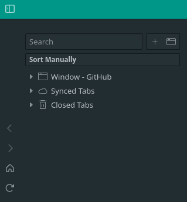

# vivaldi css modding

I'll document them a bit more if anyone is intereted!

Target end of my style is:
- use the address bar only in the tob tab
- use the windows panel instead of tabs (for its more compact nature).
- implement some css animations to automatically show bookmark bar and side panels on hover

## Instructions for use[(ref.)](https://forum.vivaldi.net/topic/10549/modding-vivaldi)
```bash
git clone https://github.com/Pugens/Vivaldi
```

Adding Style (CSS):
- Open [vivaldi://experiments](vivaldi://experiments)
- Enable "Allow for using CSS modifications".
- Open Appearance section in settings.
- Under "Custom UI Modifications" choose this folder you cloned.
- Place your CSS files inside this folder.
- IMPORTANT: The CSS files can't have spaces in the filename or they won't work.
- Restart Vivaldi to see them in effect.

## List of mods
- window_panel_h1_title_invisible:\


- window_panel_vivaldi_tree_title_active:\
TODO: change bacground-colr based on theme

## Dev
[vivaldi://inspect/#apps](vivaldi://inspect/#apps)
